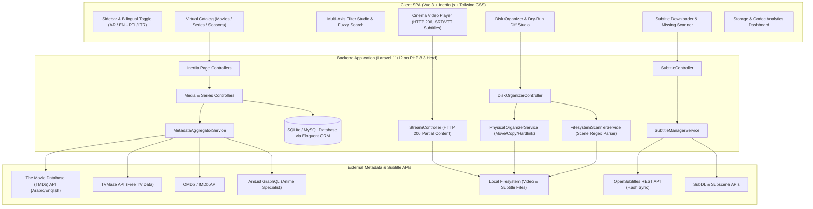

# System Architecture Specification

## 1. High-Level Architecture Diagram

## 2. Database Schema Design

- **`media_items`**: id, type (`movie`), title, original_title, title_ar, release_year, tmdb_id, imdb_id, overview, overview_ar, poster_path, backdrop_path, trailer_url, rating, runtime_minutes, resolution (`4K`, `1080p`, `720p`), video_codec, audio_codec, file_path, file_size_bytes, mood_tags, is_favorite, created_at, updated_at.
- **`series`**: id, title, title_ar, release_year, tmdb_id, tvmaze_id, overview, overview_ar, poster_path, backdrop_path, rating, status, total_seasons, network, is_favorite.
- **`seasons`**: id, series_id, season_number, title, overview, poster_path, air_date, episode_count.
- **`episodes`**: id, season_id, series_id, episode_number, title, title_ar, overview, overview_ar, still_path, runtime_minutes, air_date, resolution, video_codec, audio_codec, file_path, file_size_bytes.
- **`genres`**: id, name_en, name_ar, slug.
- **`genre_media`**: genre_id, media_id, series_id.
- **`people`**: id, name, name_ar, profile_path, tmdb_id, role (`actor`, `director`, `writer`).
- **`media_person`**: media_id, series_id, person_id, character_name, department.
- **`subtitles`**: id, media_item_id, episode_id, language (`en`, `ar`), format (`srt`, `vtt`), file_path, is_embedded, is_default.
- **`watch_histories`**: id, user_id, media_item_id, episode_id, progress_seconds, duration_seconds, is_completed, last_watched_at.
- **`download_items`**: id, title, type, source_url, destination_path, total_bytes, downloaded_bytes, status (`queued`, `downloading`, `completed`, `failed`), error_message.
- **`app_settings`**: key, value, type.
