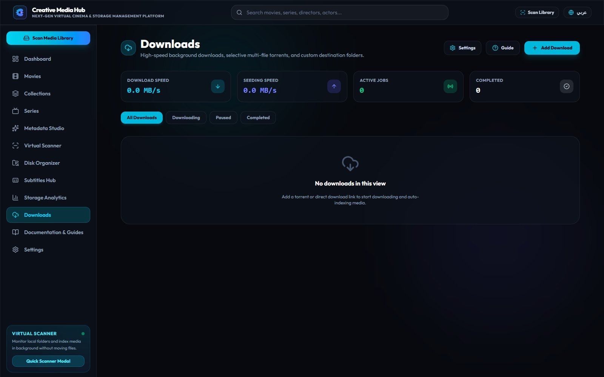
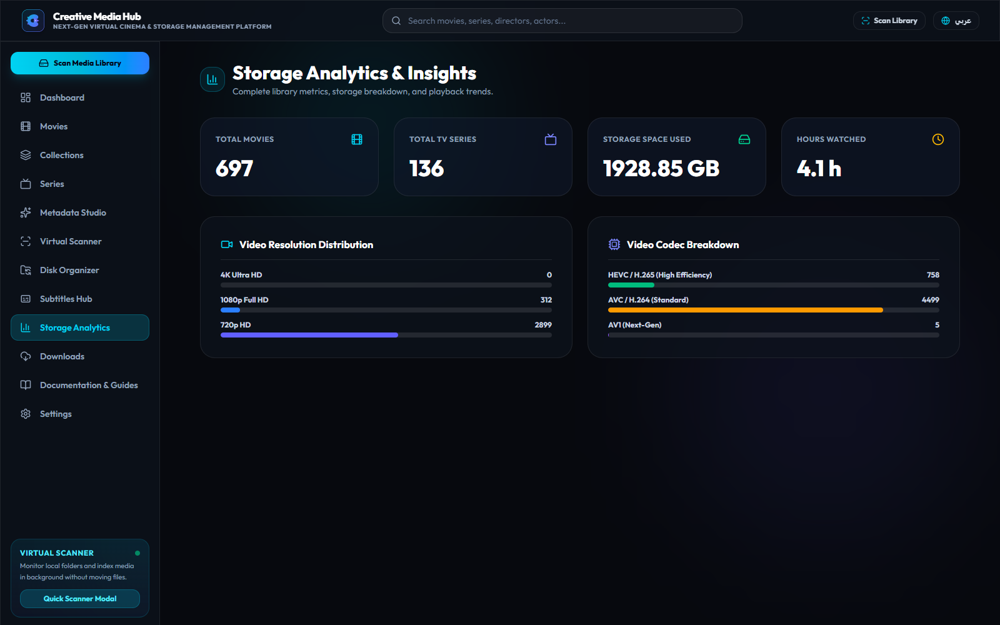
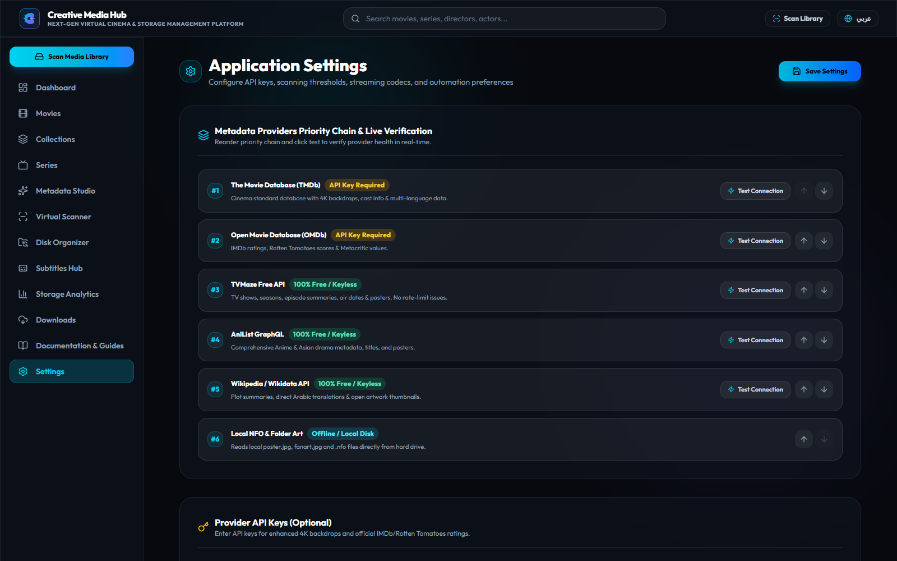
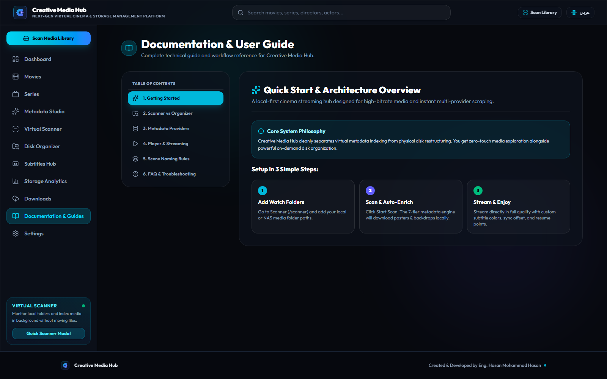

<div align="center">


# 🎬 Creative Media Hub
### **Next-Generation Personal Cinema Streaming Server & Smart Media Library**
*The high-performance, self-hosted media platform for movies, TV series, real-time subtitle translation, and instant Windows portable streaming.*

[](https://github.com/mr-creative-hmh)
[](https://php.net)
[](https://laravel.com)
[](https://vuejs.org)
[](https://inertiajs.com)
[](https://tailwindcss.com)
[](https://www.electronjs.org)
[](https://opensource.org/licenses/MIT)

</div>

---

## 📚 Complete Technical Documentation Suite

For deep architectural specifications, internal pipeline lifecycles, directory layouts, developer setup, and REST APIs, explore our modular documentation suite:

| Document | Description |
| :--- | :--- |
| 🏛️ **[docs/ARCHITECTURE.md](docs/ARCHITECTURE.md)** | Deep Clean Layered Architecture, Ports & Adapters, Hexagonal boundaries, and SQLite WAL concurrency model. |
| 📁 **[docs/STRUCTURE.md](docs/STRUCTURE.md)** | Full directory tree, controller responsibilities, service boundaries, domain models, and Vue 3 components map. |
| ⚙️ **[docs/PROCESSES.md](docs/PROCESSES.md)** | In-depth walkthrough of all 9 core pipelines (Virtual Scanner, Scene Parser, Metadata Waterfall, Boxsets Clustering, Remuxer, Hardlinks). |
| 🛠️ **[docs/DEVELOPER_GUIDE.md](docs/DEVELOPER_GUIDE.md)** | Contributor guide, local setup, running PHPUnit/Pest automated tests, adding new metadata providers, and coding standards. |
| 📡 **[docs/API_REFERENCE.md](docs/API_REFERENCE.md)** | Complete REST & Streaming API reference with query parameters, request payloads, and response structures. |

---

## 🌟 Visual Showcase

<div align="center">

### 🖥️ Dashboard & Cinema Hero Showcase


### 🎬 4K Movies Catalog with Regional Cinema Filters


### 🍿 Movie Boxsets & Franchise Sagas (2+ Films Verified)


### 📺 TV Series & Episodic Hub


### 🎯 Fix Match & Error Resolution Studio


### ⚡ Zero-Copy NTFS Hardlink Physical Organizer


### 💬 Subtitle Synchronization & Download Center


### 🧲 Smart Downloader & Torrent Multi-File Selection


### 📊 Storage Capacity & Streaming Concurrency Analytics


### ⚙️ Engine Settings & Stream Cache Manager


### 📖 Interactive Documentation Center


</div>

---

## ✨ Key Features & Capabilities

### 1. 🛡️ Subtitle Checker & Health Normalizer
- **Lexical Dialogue Language Detector**: Analyzes spoken dialogue directly (ignoring timecodes and tags) using Unicode script blocks (`\p{Arabic}` with stop-word validation, Cyrillic, CJK, Greek, Hebrew) and Latin dialogue stop-word frequency matrices (`ar`, `en`, `fr`, `es`, `de`, `it`, `pt`, `tr`, `nl`).
- **Encoding Normalizer**: Automatically decodes Windows-1256 (Arabic CP1256), ISO-8859-6, Windows-1252, ISO-8859-1, UTF-16, and UTF-8 BOM into clean UTF-8.
- **Strict Integrity Purger**: Detects 0-byte corrupt files, HTML 404/503 Cloudflare pages, and dummy stubs (< 5 cues or < 300 bytes), deleting them from disk and database.
- **Standardized Extension Renamer**: Renames adjacent subtitle files to standard convention: `{mediaBase}.{lang}.srt` (e.g. `Gladiator (2000).ar.srt`, `Gladiator (2000).en.srt`).
- **CLI & Web Studio**: Available via `php artisan subtitles:check {--fix} {--dry-run} {--path=}` and interactive Subtitle Studio UI.

### 2. 💬 100% Real Subtitle Cloud Engine & In-Player Search
- **Zero Fake Subtitles**: Removed all mock generator placeholders. Real online search via SubDL and OpenSubtitles v3.
- **Cinemeta Dynamic IMDb Discovery**: Automatically discovers IMDb IDs (`ttXXXXXXX`) on the fly without user input.
- **In-Player Subtitle Modal**: Search, preview ratings/downloads, and 1-click download directly inside `CinemaPlayer.vue`.
- **Gzip & Zip Decompressor**: Automatically unpacks compressed subtitle archives and attaches them to the playing track instantly.

### 3. 🎯 Fix Match & Direct ID Resolution Studio
- **Direct ID Lookup**: Instantly fetch and apply full bilingual metadata by exact TMDb numeric ID (e.g. `27205`), IMDb ID (`tt1375666`), or direct TMDb/IMDb URLs.
- **Automatic Fallback Waterfall**: Queries TMDb `/find` external source with automatic fallback to OMDb.
- **Bilingual Arabization & Artwork Caching**: Automatically saves English and Arabic titles and synopses, and caches high-res artwork locally.
- **1-Click Movie ↔ Series Converter & Scene Re-Parser**: Instantly convert accidental classifications and re-evaluate filenames.
- **Collection Studio Tab (`FixMatchModal.vue`)**: Dedicated franchise management tab with instant search across existing collections, 1-click assignment, custom collection creation, TMDb collection ID linkage, and automated physical folder realignment.

### 4. 🧲 Smart Downloader with Torrent Multi-File Selection
- **Multi-File Torrent Checklist**: Inspects torrents and magnet links, allowing users to select individual video files with quick buttons (`Select All`, `Videos Only`, `Clear`).
- **Direct vs Torrent Modes**: Dedicated modes for direct HTTP downloads and P2P torrent streaming ingestion.
- **Default vs Custom Folder Routing**: Automatically routes movies and series to default library folders or custom user-selected paths.

### 5. 🍿 Movie Boxsets & Franchise Sagas (Strict `owned >= 2`)
- **Strict Franchise Verification**: Eliminates solitary 1-movie false positives from `/collections` by enforcing a strict `owned >= 2` rule.
- **Real-Time Saga Completion & Media Scout Integration**: Displays true completion percentages, release spans, and "In Progress" badges calculated against complete TMDb franchise parts.
- **Missing Film Identification**: Pinpoints missing franchise installments with 1-click search and acquisition triggers.
- **CLI Collection Auditor**: Built-in `php artisan library:audit-collections {--fix} {--align-physical}` command to detect unlinked franchise movies, fix database collection associations, and physically align folder structures.

### 6. 🌍 Regional Cinema Origin Filtering
- 1-Click regional filtering:
  - **Arabic Cinema (عربي)**: Egypt, Saudi Arabia, UAE, Syria, Lebanon, Jordan, Maghreb.
  - **Bollywood (بوليوود)**: Hindi, Tamil, Telugu cinema.
  - **Asian Cinema (آسيوي)**: Japan (Anime), South Korea, Hong Kong, China, Thailand.
  - **Turkish Cinema (تركي)**: Turkish dramas and feature films.
  - **Hollywood & Western**: US, UK, Australia, Canada.
  - **European Cinema**: France, Germany, Italy, Spain, Scandinavia.

### 7. 🕒 Watch History Hub & Scoped Progress Bars (سجل المشاهدة)
- **Dedicated Watch History Hub (`/watch-history`)**:
  - **Categorized Views**: Filterable sections for **All**, **Movies (الأفلام)**, **Series (المسلسلات)**, and **Collections (السلاسل)** with live counter badges.
  - **Smart Series Aggregation**: Groups TV episodes to display the latest watched episode per series with next-episode context and show banner.
  - **Instant Playback Resume**: One-click resumption directly into the Cinema Player at the exact saved second with progress bar indicators.
  - **Live Search**: Instant client-side search filtering across titles, episode names, and franchise collections.
  - **Individual Removal & Clean Slate**: Hover "Remove" button per card with instant toast notification, plus a "Clear All" modal dialog with destructive confirmation.
- **Context-Segregated Progress Bars (`WatchHistoryBar`)**:
  - **Movies Page**: In-progress feature films with individual remove buttons and a "View All" link to the Hub.
  - **Series Page**: Latest in-progress TV show episodes.
  - **Collections Page**: Latest in-progress franchise movies.
  - **Dashboard**: Focused spotlight tray with direct navigation to the full history.
- **Robust Persistence & API**:
  - Deduplicated `watch_histories` records backed by unique `[watchable_type, watchable_id]` database constraints.
  - Full RESTful endpoints (`GET /api/watch-history`, `DELETE /api/watch-history/{id}`, `DELETE /api/watch-history`, `POST /api/watch-history/progress`).

### 8. 🧠 Intelligent Scene Name Parser (Arabic & Multilingual Engine)
- Normalizes Eastern Arabic numerals (`١, ٢, ٣ → 1, 2, 3`).
- Folder ancestor context inheritance: resolves episode numbers from nested structures (`Breaking Bad/Season 01/01.mp4`).
- Distinguishes movie franchise sequence numbers from TV episodes inside movie folders (`1.Ip.Man.2008.mp4` → Movie Part 1).

### 9. ⚡ Hybrid Video Streaming & Intelligent Remuxing
- **Intelligent Direct Stream Engine**: Automatically defaults to zero-CPU native byte-range streaming (`HTTP 206 Partial Content`) for all web-compatible formats (`.mp4`, `.mkv`, `H.264/AVC`, `VP9`, `AV1`, `AAC`, `Dolby Digital AC3/E-AC3`), eliminating unnecessary server load.
- **Timestamp Synchronization (Zero Lag)**: Direct stream circumvents timestamp drifting entirely, while background remuxing uses continuous PTS alignment without desync.
- **Self-Healing Fallback**: Automatically switches to Ultra-Fast Remux within 100ms if native browser hardware decoders report an unsupported profile.
- **User Preference Memory**: Manual stream toggles ("Direct Stream" vs "Ultra-Fast Remux") are remembered per title and persisted in `localStorage`.

### 10. 🔗 Zero-Copy NTFS Hardlink Organizer
- Restructures chaotic folders into pristine paths (`Movies/Title (Year)/Title (Year) [1080p].ext`) using NTFS hardlinks (`mklink /H`).
- **0 bytes** duplicated on disk and continuous torrent seeding remains 100% active.
- Includes side-by-side Dry-Run simulation before execution.

### 11. ✍️ Arabic & English Subtitle Typography Studio
- **Curated Arabic Typography**: Native integration with Google Fonts (**Cairo**, **Plus Jakarta Sans**, **IBM Plex Sans Arabic**, **Almarai**, and **Alexandria**).
- **In-Player Subtitle Font Selector**: Users can switch between **Cairo**, **Jakarta**, and **System** fonts on the fly.
- **Cinema-Grade Contrast**: Multi-layered text shadow (`0 2px 4px rgba(0,0,0,0.95), 0 0 3px #000, 1px 1px 2px #000...`) ensures crystal-clear legibility across bright or dark scenes.

### 12. 🌐 Bilingual Interface & Player Usability
- **Bilingual Interface (Arabic / English)**: Instant switching between Arabic and English across all catalog pages, regional filters, metadata studio, and subtitle managers.
- **Cinema Player Layout Ergonomics**: While catalog pages adopt natural RTL flow when Arabic is active, `CinemaPlayer.vue` maintains a stable LTR component direction (`dir="ltr"`) for its timeline scrubber, volume slider, playhead, and buffer tracks—preventing reversed slider math while rendering complete Arabic dialogue, track names, settings, and WebVTT typography.

### 13. 🧹 Media Streams & Transcode Cache Manager
- **Disk Usage Inspection**: Real-time stats card in Settings showing current cache size (e.g., `140.75 MB`, `1.4 GB`) and cached file count in `storage/app/cache/media_streams/`.
- **1-Click Cache Cleaner**: Safely purges accumulated remux and transcode files with instant toast feedback showing freed space.

### 14. 🪐 Holographic Cinema Orbit Loaders & Transit Island
- **Cinema Multi-Orbit Loader (`CinemaLoader.vue`)**: Replaces standard spinning rings with a multi-tiered glowing celestial orbit, reverse-spinning violet comet, and ambient pulsing core.
- **Live Glassmorphic Buffering Status**: Floating status card with animated multi-bar equalizer waveforms and real-time stream resolution metadata.
- **Top-Center Transit Island (`PageTransitionLoader.vue`)**: Dynamic island docked top-center that indicates smooth page transitions without colliding with header navigation.
- **Bidirectional Progress Laser**: Mirrored laser progress bar (`[dir="rtl"] scaleX(-1)`) that physically advances Right-to-Left in Arabic and Left-to-Right in English.

### 15. 🏛️ Consolidated Master Schema & Zero-Demo Seeders
- **Consolidated 2-Migration Architecture**: All legacy migration fragments merged into two canonical definitions:
  - `0001_01_01_000000_create_system_tables.php` (sessions, cache, queue jobs).
  - `2026_09_01_000000_create_media_hub_tables.php` (clean consolidated schema for media items, series, seasons, episodes, genres, credits, subtitles, watch history, downloads, and app settings).
- **Pure Local-First Cinema (Zero Auth Overhead)**: Unnecessary user accounts, password authentication, and session barriers removed for a streamlined home theatre appliance experience.
- **Production-Only Clean Seeder**: `MediaLibrarySeeder` seeds pure essential system defaults (15 official TMDb genres with Arabic/English names and core application settings) with zero mock movies, fake series, or dummy subtitle records.

### 16. ⚡ Unified Universal Activity Center (`UnifiedJobCenterModal.vue`)
- **Global Ambient Island**: Floating activity pill docked across `Navbar.vue`, `Sidebar.vue`, and `AppLayout.vue` with dynamic status counters and pulsing progress halos.
- **Unified Batch & Background Task Orchestration**: Real-time control across all active jobs from a single modal:
  - 📁 **Disk Organizer & Hardlink Engine**: Interactive plan inspection with Pause, Resume, and Cancel execution.
  - 🔍 **Virtual Library Scanner**: Live path discovery, item counters, and non-blocking Pause/Resume/Cancel.
  - 💬 **Subtitle Health Auditor**: Spoken dialogue scanner, encoding fixer, and cancellable execution.
  - 👁️ **Persistent Downloads Watcher**: Background filesystem monitoring daemon with toggleable active state.
- **Zero-Page-Reload Reactive Progress**: Elapsed timers, live active file indicators, and instant notification toasts.

### 17. 🛡️ Database Backup, Disaster Recovery & Selective Restore
- **1-Click Live JSON Export**: Direct stream download of your entire library database (`/api/database/backup/export` & `/api/library/backup`).
- **Server Snapshots**: Instant snapshot creation (`.json` and `.sqlite` binary copies) stored securely in `storage/app/backups`.
- **Granular Selective Restore**: Choose precisely which library sections to restore without touching the rest of your library:
  - 🎬 **Movies & Collections** (`movies`): Restores movie titles, file paths, artwork links, and associated genres/cast.
  - 📺 **TV Series, Seasons & Episodes** (`series`): Restores TV shows, seasons structure, and episode data.
  - 💬 **Subtitles** (`subtitles`): Restores subtitle records, tracks, and language tags.
  - ⚙️ **System Settings & API Keys** (`settings`): Restores API keys, provider priorities, and library configs.
  - ⏱️ **Watch History & Progress** (`watch_history`): Restores playback positions, timestamps, and completed flags.
- **Zero Data Loss Guarantee**: In Clean Overwrite mode, unselected sections remain 100% untouched and safe.
- **Pre-Restore Rollback Snapshot**: An automatic safety snapshot is taken immediately before any restoration begins.
- **Multi-Format Ingestion**: Supports `.json`, `.sqlite`, and `.db` backups with PDO table extraction for selective restoration.

### 18. 👁️ Autonomous Downloads Watcher & Background Reorganizer
- **Stateful Filesystem Daemon**: `OrganizerWatcherService` monitors incoming download directories for newly completed movies and TV episodes.
- **Reboot-Resistant Persistence**: Active status and watched folder paths are persisted in `app_settings`.
- **CLI & Scheduled Execution**: Available via `php artisan organizer:watch {--daemon}` and Laravel schedule worker.

### 19. 🌐 Multi-Provider Metadata Waterfall & Live Health Verification
- **Zero-Key Free Metadata Chain**: TVMaze Free API, AniList GraphQL, and Wikipedia/Wikidata API operate alongside TMDb and OMDb.
- **Live Connectivity Testing**: Re-order provider priority and test API connectivity in real time directly from Settings.
- **Fix Match Studio Enhancements**: Direct ID resolution (TMDb, IMDb, TVMaze), automatic Arabic title/synopsis fetch, multi-format poster detection (`.jpg`, `.png`, `.webp`), and season/episode artwork synchronization.

### 20. 📡 Media Scout & Smart Library Acquisition
- **Real-Time Gap Tracking (`LibraryGapService`)**: Automatically audits movie sagas and TV series seasons against official TMDb parts, calculating exact missing counts and saga completion percentages.
- **Automated Season Torrent Acquisition (`LibraryAcquisitionService`)**: Automatically searches, scrapes, filters, and triggers batch downloads for missing episodes or seasons.
- **Post-Download Processing Pipeline**: Recursively flattens downloaded archives, standardizes video files to canonical naming conventions (`Show - S01E01 - Title [1080p].ext`), relocates companion subtitle files (`.ar.srt`, `.en.srt`), and cleans up empty download folders.

### 21. 🎞️ Multi-Episode Scene Parsing & Database Multiplication
- **Canonical Multi-Episode Scene Formats**: Fully parses combined episode naming schemes (`S01E01-E02`, `S01E01E02`, `S01E01-02`, `S01E01.E02`) without misidentifying resolution tags (such as `.1080p`) as episode numbers.
- **Database Entity Multiplication**: The Virtual Library Scanner automatically creates and populates individual `Episode` database records for every episode covered in the multi-part file, fetching distinct TMDb titles and synopses.
- **Shared Media File & Subtitle Linkage**: Links each individual episode record to the same shared physical video file and replicates subtitle track attachments so each episode streams seamlessly.
- **Physical Organizer Token Integration**: The `{Episode:02}` token automatically formats multi-episodes as `01-E02` on disk, and `updateDatabasePath()` synchronizes all sibling episode records in one atomic pass.

### 22. 🔄 Rescan & Relocation Deduplication Engine
- **Alphanumeric Title Normalization**: Compares sanitized alphanumeric strings to accurately correlate existing library items when folder names vary slightly (e.g. *Sense8* vs *Sense 8*).
- **In-Place Path Relocation**: Updates the existing series and episode records in the database rather than creating duplicate series or detached episodes when folders are moved.


---

## 🚀 Quick Start & Installation

### 1. Prerequisites
- **PHP 8.2+** with extensions: `pdo_sqlite`, `fileinfo`, `curl`, `mbstring`, `openssl`.
- **Node.js 20+** and **npm 10+**.
- **Composer 2.x**.
- **FFmpeg & FFprobe 6.x / 7.x** (detected from PATH or Herd).

### 2. Setup Commands
```bash
# 1. Clone repository
git clone https://github.com/mr-creative-hmh/creative-media-hub.git
cd creative-media-hub

# 2. Install PHP and JS dependencies
composer install
npm install

# 3. Environment & Key Generation
cp .env.example .env
php artisan key:generate

# 4. Database Initialization & Schema Migration
touch database/database.sqlite
php artisan migrate

# 5. Build Assets & Start Server
npm run build
php artisan serve
```

---

## 🧪 Testing & Verification

Creative Media Hub comes with a test suite covering parsers, streaming responses, and metadata cascades.

```bash
# Run all automated tests
php artisan test

# Verify frontend assets compilation
npm run build
```

---

## 💻 Windows Desktop App (Electron Standalone)

Run Creative Media Hub as a standalone desktop cinema application:

```bash
# Start in Electron development mode
npm run electron:dev

# Package as a portable Windows executable (.exe)
npm run electron:build
```

---

## 👨‍💻 Author & Lead Architect

**Eng. Hasan Mohammad Hasan**  
- GitHub: [@mr-creative-hmh](https://github.com/mr-creative-hmh)  
- Project: [Creative Media Hub](https://github.com/mr-creative-hmh/creative-media-hub)  

---

## 📜 License

Creative Media Hub is open-source software licensed under the **[MIT License](LICENSE)**.
