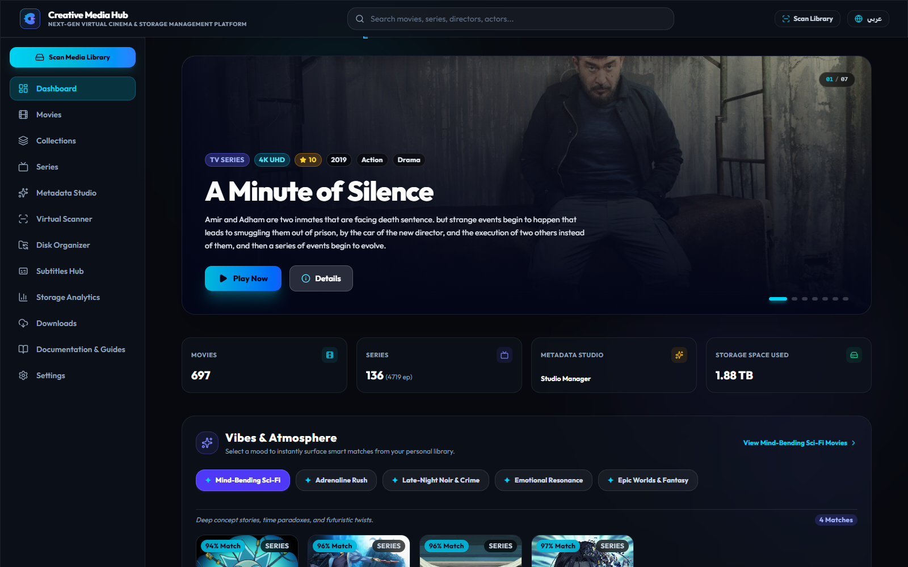
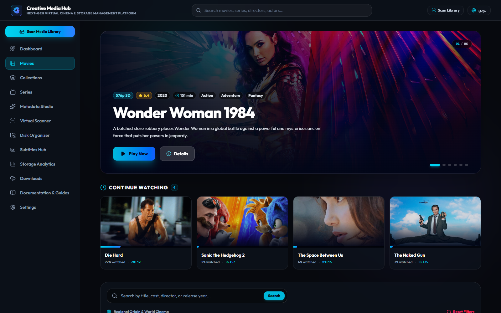
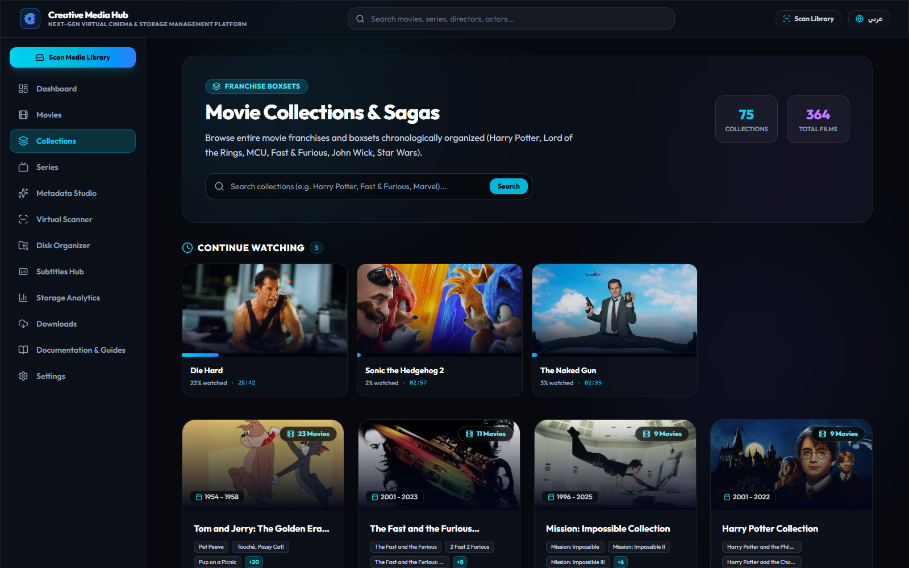
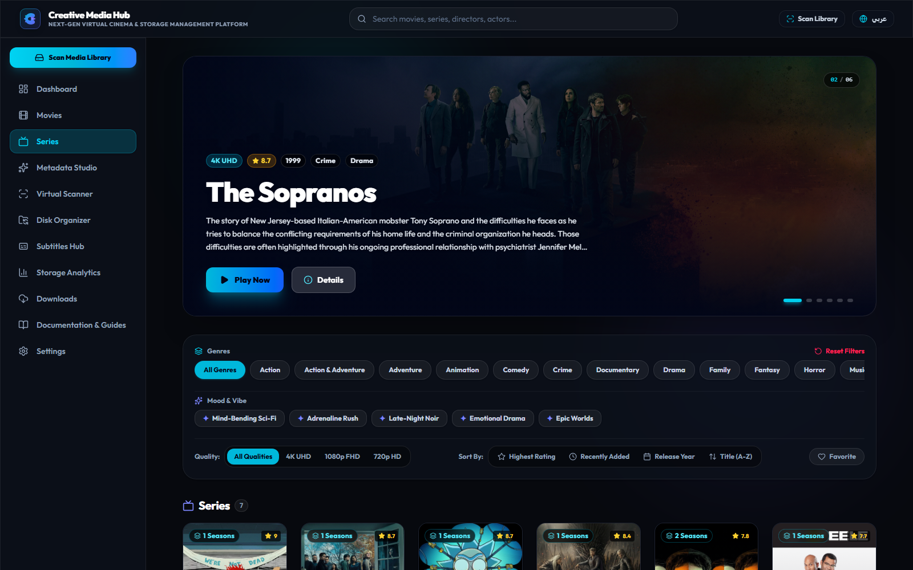
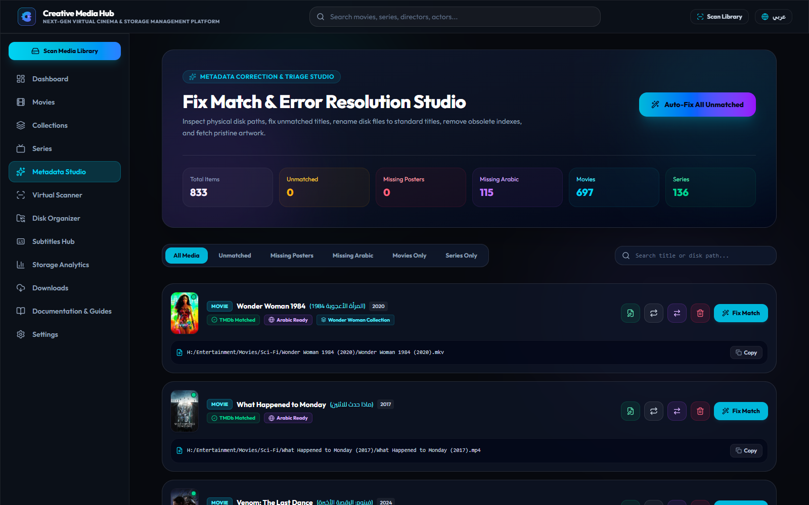
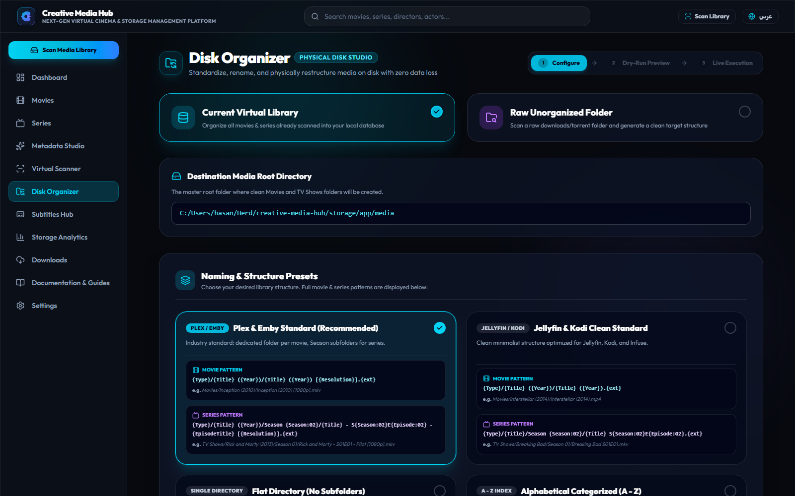
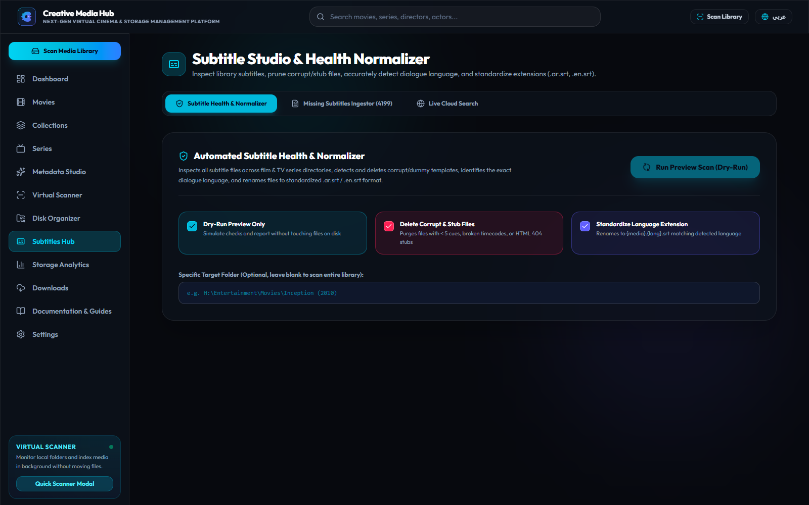

<div align="center">


# 🎬 Creative Media Hub
### **Next-Generation Personal Cinema Streaming Server & Smart Media Library**
*The high-performance, self-hosted media platform for movies, TV series, real-time subtitle translation, and instant Windows portable streaming.*

[](https://github.com/mr-creative-hmh)
[](https://php.net)
[](https://laravel.com)
[](https://vuejs.org)
[](https://inertiajs.com)
[](https://tailwindcss.com)
[](https://www.electronjs.org)
[](https://opensource.org/licenses/MIT)

</div>

---

## 📚 Complete Technical Documentation Suite

For deep architectural specifications, internal pipeline lifecycles, directory layouts, developer setup, and REST APIs, explore our modular documentation suite:

| Document | Description |
| :--- | :--- |
| 🏛️ **[docs/ARCHITECTURE.md](docs/ARCHITECTURE.md)** | Deep Clean Layered Architecture, Ports & Adapters, Hexagonal boundaries, and SQLite WAL concurrency model. |
| 📁 **[docs/STRUCTURE.md](docs/STRUCTURE.md)** | Full directory tree, controller responsibilities, service boundaries, domain models, and Vue 3 components map. |
| ⚙️ **[docs/PROCESSES.md](docs/PROCESSES.md)** | In-depth walkthrough of all 9 core pipelines (Virtual Scanner, Scene Parser, Metadata Waterfall, Boxsets Clustering, Remuxer, Hardlinks). |
| 🛠️ **[docs/DEVELOPER_GUIDE.md](docs/DEVELOPER_GUIDE.md)** | Contributor guide, local setup, running PHPUnit/Pest automated tests, adding new metadata providers, and coding standards. |
| 📡 **[docs/API_REFERENCE.md](docs/API_REFERENCE.md)** | Complete REST & Streaming API reference with query parameters, request payloads, and response structures. |

---

## 🌟 Visual Showcase

<div align="center">

### 🖥️ Dashboard & Cinema Hero Showcase


### 🎬 4K Movies Catalog with Regional Cinema Filters


### 🍿 Movie Boxsets & Franchise Sagas (2+ Films Verified)


### 📺 TV Series & Episodic Hub


### 🎯 Fix Match & Error Resolution Studio


### ⚡ Zero-Copy NTFS Hardlink Physical Organizer


### 💬 Subtitle Synchronization & Download Center


</div>

---

## ✨ Key Features & Capabilities

### 1. 🛡️ Subtitle Checker & Health Normalizer
- **Lexical Dialogue Language Detector**: Analyzes spoken dialogue directly (ignoring timecodes and tags) using Unicode script blocks (`\p{Arabic}` with stop-word validation, Cyrillic, CJK, Greek, Hebrew) and Latin dialogue stop-word frequency matrices (`ar`, `en`, `fr`, `es`, `de`, `it`, `pt`, `tr`, `nl`).
- **Encoding Normalizer**: Automatically decodes Windows-1256 (Arabic CP1256), ISO-8859-6, Windows-1252, ISO-8859-1, UTF-16, and UTF-8 BOM into clean UTF-8.
- **Strict Integrity Purger**: Detects 0-byte corrupt files, HTML 404/503 Cloudflare pages, and dummy stubs (< 5 cues or < 300 bytes), deleting them from disk and database.
- **Standardized Extension Renamer**: Renames adjacent subtitle files to standard convention: `{mediaBase}.{lang}.srt` (e.g. `Gladiator (2000).ar.srt`, `Gladiator (2000).en.srt`).
- **CLI & Web Studio**: Available via `php artisan subtitles:check {--fix} {--dry-run} {--path=}` and interactive Subtitle Studio UI.

### 2. 💬 100% Real Subtitle Cloud Engine & In-Player Search
- **Zero Fake Subtitles**: Removed all mock generator placeholders. Real online search via SubDL and OpenSubtitles v3.
- **Cinemeta Dynamic IMDb Discovery**: Automatically discovers IMDb IDs (`ttXXXXXXX`) on the fly without user input.
- **In-Player Subtitle Modal**: Search, preview ratings/downloads, and 1-click download directly inside `CinemaPlayer.vue`.
- **Gzip & Zip Decompressor**: Automatically unpacks compressed subtitle archives and attaches them to the playing track instantly.

### 3. 🎯 Fix Match & Direct ID Resolution Studio
- **Direct ID Lookup**: Instantly fetch and apply full bilingual metadata by exact TMDb numeric ID (e.g. `27205`), IMDb ID (`tt1375666`), or direct TMDb/IMDb URLs.
- **Automatic Fallback Waterfall**: Queries TMDb `/find` external source with automatic fallback to OMDb.
- **Bilingual Arabization & Artwork Caching**: Automatically saves English and Arabic titles and synopses, and caches high-res artwork locally.
- **1-Click Movie ↔ Series Converter & Scene Re-Parser**: Instantly convert accidental classifications and re-evaluate filenames.

### 4. 🧲 Smart Downloader with Torrent Multi-File Selection
- **Multi-File Torrent Checklist**: Inspects torrents and magnet links, allowing users to select individual video files with quick buttons (`Select All`, `Videos Only`, `Clear`).
- **Direct vs Torrent Modes**: Dedicated modes for direct HTTP downloads and P2P torrent streaming ingestion.
- **Default vs Custom Folder Routing**: Automatically routes movies and series to default library folders or custom user-selected paths.

### 5. 🍿 Movie Boxsets & Franchise Sagas
- Clusters multi-film movie franchises (e.g. *Harry Potter (9 films)*, *Fast & Furious (11 films)*, *The Dark Knight Trilogy*, *Knives Out*, *Ip Man Collection*) with chronological release timelines.
- Intelligent **`count >= 2`** threshold eliminates solitary 1-movie false positives from `/collections`.

### 6. 🌍 Regional Cinema Origin Filtering
- 1-Click regional filtering:
  - **Arabic Cinema (عربي)**: Egypt, Saudi Arabia, UAE, Syria, Lebanon, Jordan, Maghreb.
  - **Bollywood (بوليوود)**: Hindi, Tamil, Telugu cinema.
  - **Asian Cinema (آسيوي)**: Japan (Anime), South Korea, Hong Kong, China, Thailand.
  - **Turkish Cinema (تركي)**: Turkish dramas and feature films.
  - **Hollywood & Western**: US, UK, Australia, Canada.
  - **European Cinema**: France, Germany, Italy, Spain, Scandinavia.

### 7. ⏱️ Scoped Continue Watching Bars
- Context-segregated continue watching trays:
  - **Movies Page**: Displays only in-progress feature films.
  - **Series Page**: Displays only in-progress TV show episodes.
  - **Collections Page**: Displays only in-progress franchise movies.
  - **Dashboard**: Clean cinematic spotlight without redundant clutter.

### 8. 🧠 Intelligent Scene Name Parser (Arabic & Multilingual Engine)
- Normalizes Eastern Arabic numerals (`١, ٢, ٣ → 1, 2, 3`).
- Folder ancestor context inheritance: resolves episode numbers from nested structures (`Breaking Bad/Season 01/01.mp4`).
- Distinguishes movie franchise sequence numbers from TV episodes inside movie folders (`1.Ip.Man.2008.mp4` → Movie Part 1).

### 9. ⚡ Hybrid Video Streaming & Remuxing
- **Direct Stream (HTTP 206 Partial Content)**: Zero-CPU byte-range streaming for MP4 / H.264 / AAC.
- **On-The-Fly FFmpeg Remuxer**: Real-time stdout remuxing for legacy containers (AVI, MKV, MPEG-4, DTS) into fragmented MP4.
- **FastStart Disk Caching**: Transcode-caches remuxed streams in background for instantaneous seeking upon replay.

### 10. 🔗 Zero-Copy NTFS Hardlink Organizer
- Restructures chaotic folders into pristine paths (`Movies/Title (Year)/Title (Year) [1080p].ext`) using NTFS hardlinks (`mklink /H`).
- **0 bytes** duplicated on disk and continuous torrent seeding remains 100% active.
- Includes side-by-side Dry-Run simulation before execution.

---

## 🚀 Quick Start & Installation

### 1. Prerequisites
- **PHP 8.2+** with extensions: `pdo_sqlite`, `fileinfo`, `curl`, `mbstring`, `openssl`.
- **Node.js 20+** and **npm 10+**.
- **Composer 2.x**.
- **FFmpeg & FFprobe 6.x / 7.x** (detected from PATH or Herd).

### 2. Setup Commands
```bash
# 1. Clone repository
git clone https://github.com/mr-creative-hmh/creative-media-hub.git
cd creative-media-hub

# 2. Install PHP and JS dependencies
composer install
npm install

# 3. Environment & Key Generation
cp .env.example .env
php artisan key:generate

# 4. Database Initialization & Schema Migration
touch database/database.sqlite
php artisan migrate

# 5. Build Assets & Start Server
npm run build
php artisan serve
```

---

## 🧪 Testing & Verification

Creative Media Hub comes with a test suite covering parsers, streaming responses, and metadata cascades.

```bash
# Run all automated tests
php artisan test

# Verify frontend assets compilation
npm run build
```

---

## 💻 Windows Desktop App (Electron Standalone)

Run Creative Media Hub as a standalone desktop cinema application:

```bash
# Start in Electron development mode
npm run electron:dev

# Package as a portable Windows executable (.exe)
npm run electron:build
```

---

## 👨‍💻 Author & Lead Architect

**Eng. Hasan Mohammad Hasan**  
- GitHub: [@mr-creative-hmh](https://github.com/mr-creative-hmh)  
- Project: [Creative Media Hub](https://github.com/mr-creative-hmh/creative-media-hub)  

---

## 📜 License

Creative Media Hub is open-source software licensed under the **[MIT License](LICENSE)**.
